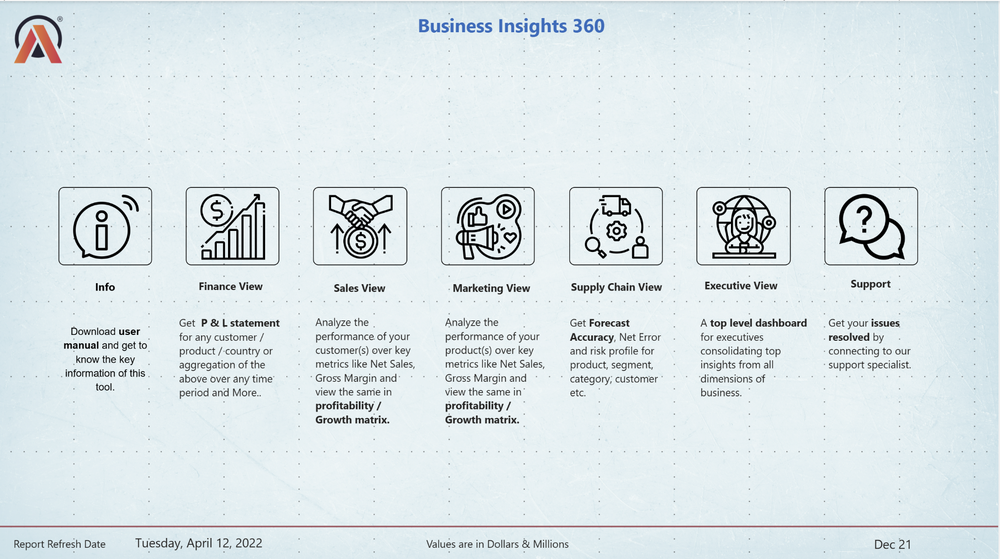
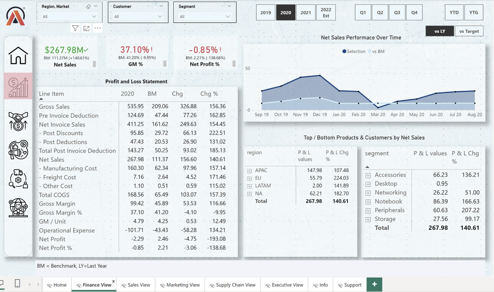
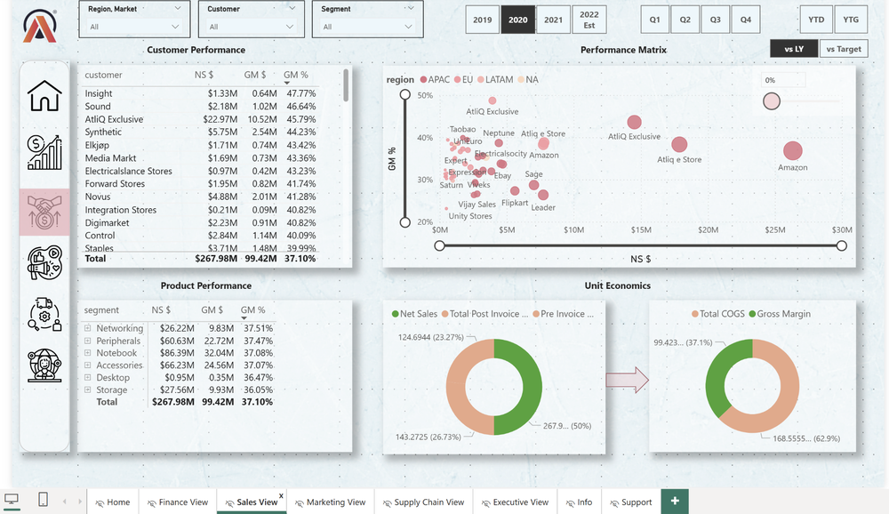
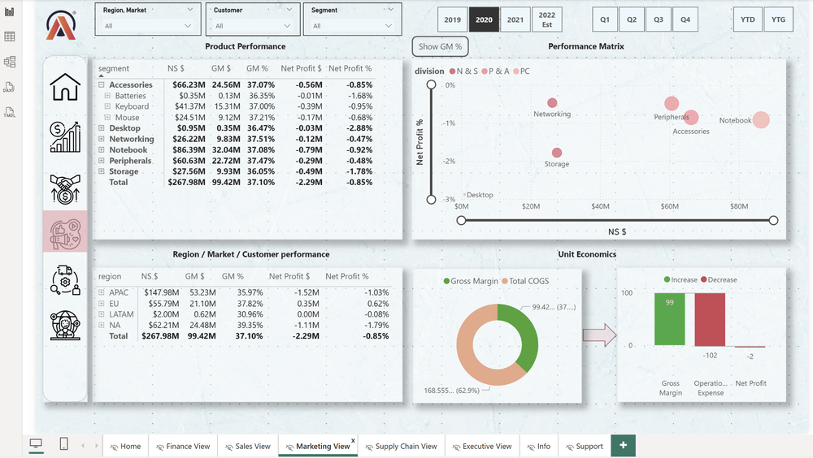
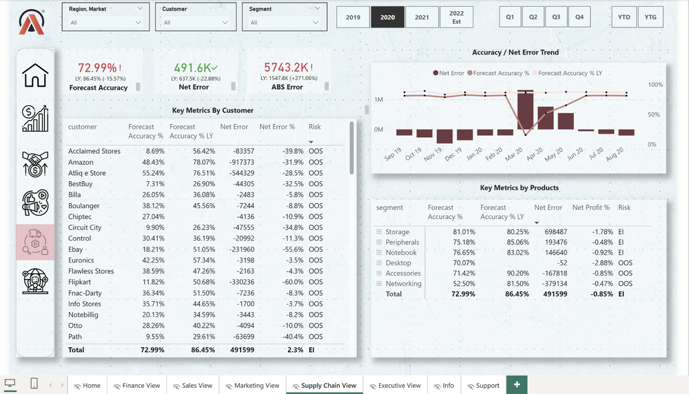
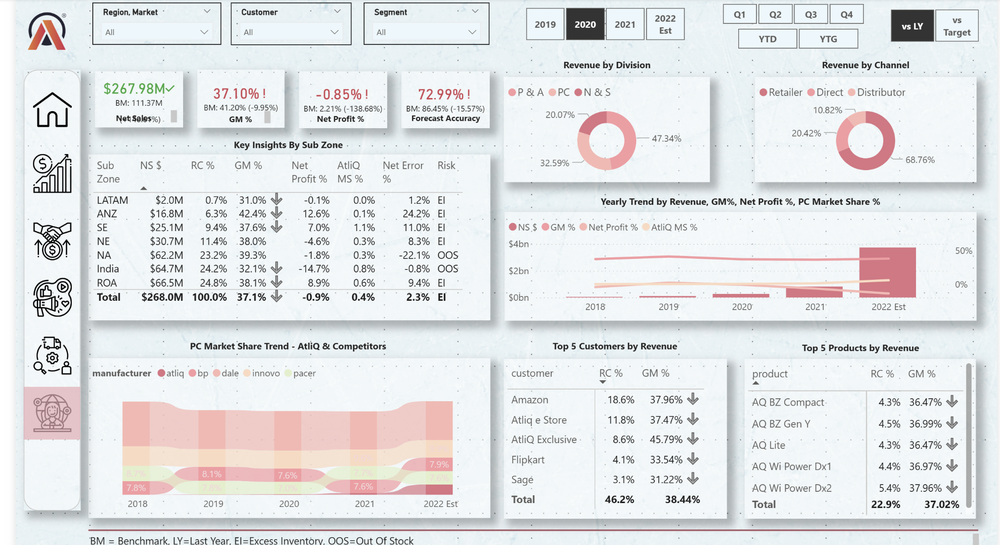
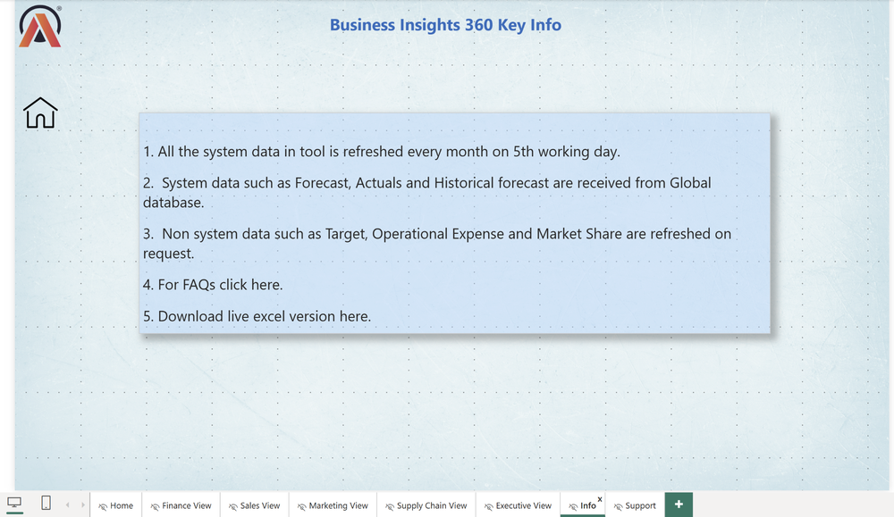
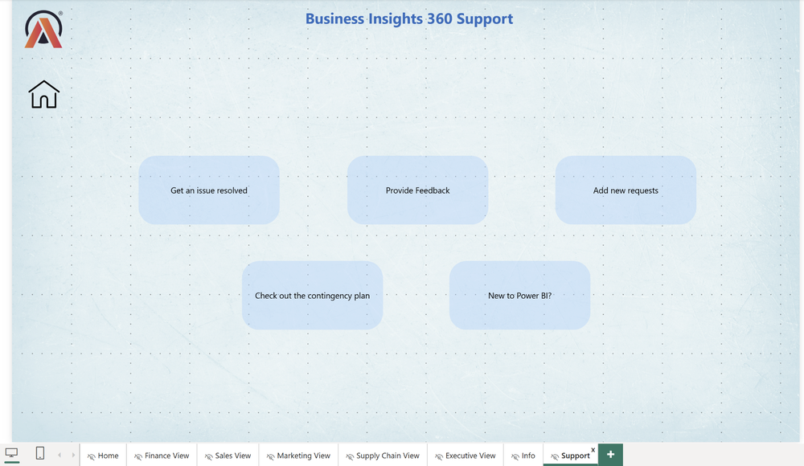

# Business Insights 360 – AtliQ Hardwares (Power BI Project)

## 📌 Problem Statement
AtliQ Hardwares, a global consumer electronics company, was experiencing rapid growth but still relied heavily on Excel for analytics. This led to fragmented reports, delayed insights, and even a significant business loss in the Latin American market. Leadership needed a centralized BI solution to unify Finance, Sales, Marketing, and Supply Chain data under one platform.

## 🎯 The Mission
To design a CEO-ready, multi-dashboard Power BI solution that delivers real-time KPIs, trend analysis, and performance breakdowns — enabling faster, data-driven decisions across all departments.

## ⚡ Solution
I developed the **Business Insights 360 Dashboard** in Power BI, providing:
- 💰 **Finance View** – P&L by product, country, and customer  
- 📈 **Sales View** – Profitability and growth metrics by customer & product  
- 🎯 **Marketing View** – Performance matrix by product segment  
- 🚚 **Supply Chain View** – Forecast accuracy, net error trends, and risk profiling  
- 🧠 **Executive View** – Consolidated leadership dashboard with KPIs and market share  
- ℹ️ **Info View** – Key references and data refresh guidelines  
- 🆘 **Support View** – Guidance, feedback, and contingency plan  

---

## 📊 Dashboard Views

### Navigation Page

### 💰 Finance View

### 📈 Sales View

### 🎯 Marketing View

### 🚚 Supply Chain View

### 🧠 Executive View

### ℹ️ Info View

### 🆘 Support View

---

## 💡 Key Insights Covered
- **Finance View:** P&L analysis revealed that while overall revenue grew steadily, certain regions like **Latin America underperformed**, leading to net profit margin erosion.  
- **Sales View:** Top 20% of customers contributed to more than 60% of net sales, highlighting **high customer concentration risk** and the need for diversification.  
- **Marketing View:** Product segments in the **premium category showed higher ROI** on marketing spend, while entry-level segments underperformed despite high spend.  
- **Supply Chain View:** Forecast accuracy was below 70% in key markets, with **consistent net error trends** causing inventory imbalances and missed opportunities.  
- **Executive View:** A consolidated KPI dashboard revealed that despite regional setbacks, **global market share increased by ~2%**, positioning AtliQ as a stronger competitor in growth markets.  

---

## 🛠 Tools & Skills
- Power BI (Data Modeling, DAX, Interactive Dashboards)  
- SQL & Excel for data preparation  
- Data Storytelling & Visualization Best Practices  

## 🔗 Live Dashboard
[👉 Explore the Interactive Dashboard](https://app.powerbi.com/links/IZI14XrE7L?ctid=c6e549b3-5f45-4032-aae9-d4244dc5b2c4&pbi_source=linkShare&bookmarkGuid=319b9e06-0cbf-4fc5-a9fa-e906530eede6)

---

## 🙌 Credit
This project was **built as part of the Codebasics Data Analytics Bootcamp 2.0**.  
Original concept by Ashish Babaria (Codebasics) — reimagined with my own theme, layout, and design refinements.  

---

## 🤝 Let’s Connect
I’d love to hear your feedback, discuss analytics, or connect with fellow professionals:  

- 🌐 LinkedIn: [Asim Ahmed](YOUR_LINKEDIN_PROFILE)  
- 💻 GitHub: [Asim’s GitHub](YOUR_GITHUB_PROFILE)  
- ✉️ Email: **asim.atia@gmail.com**  

---
# Business Insights 360 – AtliQ Hardwares (Power BI Project)

## 📌 Problem Statement
AtliQ Hardwares, a global consumer electronics company, was experiencing rapid growth but still relied heavily on Excel for analytics. This led to fragmented reports, delayed insights, and even a significant business loss in the Latin American market. Leadership needed a centralized BI solution to unify Finance, Sales, Marketing, and Supply Chain data under one platform.

## 🎯 The Mission
To design a CEO-ready, multi-dashboard Power BI solution that delivers real-time KPIs, trend analysis, and performance breakdowns — enabling faster, data-driven decisions across all departments.

## ⚡ Solution
I developed the **Business Insights 360 Dashboard** in Power BI, providing:
- 💰 **Finance View** – P&L by product, country, and customer  
- 📈 **Sales View** – Profitability and growth metrics by customer & product  
- 🎯 **Marketing View** – Performance matrix by product segment  
- 🚚 **Supply Chain View** – Forecast accuracy, net error trends, and risk profiling  
- 🧠 **Executive View** – Consolidated leadership dashboard with KPIs and market share  
- ℹ️ **Info View** – Key references and data refresh guidelines  
- 🆘 **Support View** – Guidance, feedback, and contingency plan  

---

## 📊 Dashboard Views

### Navigation Page

### 💰 Finance View

### 📈 Sales View

### 🎯 Marketing View

### 🚚 Supply Chain View

### 🧠 Executive View

### ℹ️ Info View

### 🆘 Support View

---

## 💡 Key Insights Covered
- **Finance View:** P&L analysis revealed that while overall revenue grew steadily, certain regions like **Latin America underperformed**, leading to net profit margin erosion.  
- **Sales View:** Top 20% of customers contributed to more than 60% of net sales, highlighting **high customer concentration risk** and the need for diversification.  
- **Marketing View:** Product segments in the **premium category showed higher ROI** on marketing spend, while entry-level segments underperformed despite high spend.  
- **Supply Chain View:** Forecast accuracy was below 70% in key markets, with **consistent net error trends** causing inventory imbalances and missed opportunities.  
- **Executive View:** A consolidated KPI dashboard revealed that despite regional setbacks, **global market share increased by ~2%**, positioning AtliQ as a stronger competitor in growth markets.  

---

## 🛠 Tools & Skills
- Power BI (Data Modeling, DAX, Interactive Dashboards)  
- SQL & Excel for data preparation  
- Data Storytelling & Visualization Best Practices  

## 🔗 Live Dashboard
[👉 Explore the Interactive Dashboard](https://app.powerbi.com/links/IZI14XrE7L?ctid=c6e549b3-5f45-4032-aae9-d4244dc5b2c4&pbi_source=linkShare&bookmarkGuid=319b9e06-0cbf-4fc5-a9fa-e906530eede6)

---

## 🙌 Credit
This project was **built as part of the Codebasics Data Analytics Bootcamp 2.0**.  
Original concept by Ashish Babaria (Codebasics) — reimagined with my own theme, layout, and design refinements.  

---

## 🤝 Let’s Connect
I’d love to hear your feedback, discuss analytics, or connect with fellow professionals:  

- 🌐 LinkedIn: [Asim Ahmed](YOUR_LINKEDIN_PROFILE)  
- 💻 GitHub: [Asim’s GitHub](YOUR_GITHUB_PROFILE)  
- ✉️ Email: **asim.atia@gmail.com**  

---
